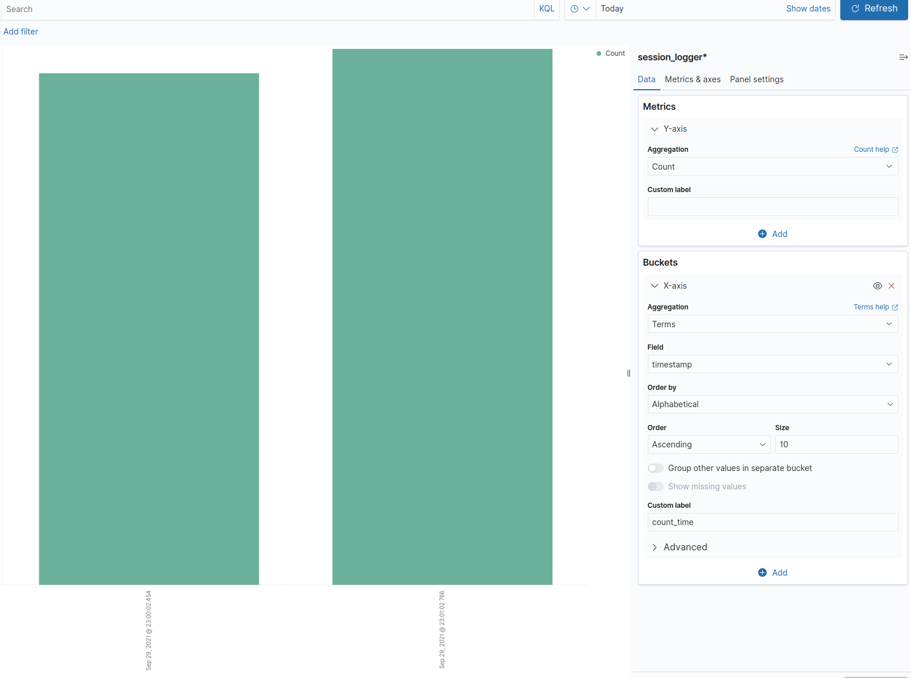

# Elasticsearch Note
## 도커로 설치
1. elk 설치
```consle
$ git clone https://github.com/deviantony/docker-elk.git
$ cd docker-elk
```
default로 X-Pack 설정이 되어있는데 무료로 사용하려면 각 Elasticsearch, Kibana, Logstash 설정파일에서 X-Pack 비활성화한다. 
```console
$ vi docker-elk/elasticsearch/config/elasticsearch.yml
$ vi docker-elk/kibana/config/kibana.yml
$ vi docker-elk/logstash/config/logstash.yml
```
[ elasticsearch ]
```bash
#xpack.license.self_generated.type: trial
#xpack.security.enabled: true
#xpack.monitoring.collection.enabled: true
```
[ logstash ]
```bash
#xpack.monitoring.elasticsearch.hosts: [ "http://elasticsearch:9200" ]
#xpack.license.self_generated.type: trial
#xpack.security.enabled: true
#xpack.monitoring.collection.enabled: true
```
[ kibana ]
```bash
#monitoring.ui.container.elasticsearch.enabled: true

## X-Pack security credentials
#
#elasticsearch.username: elastic
#elasticsearch.password: changeme
```

2. elk 실행
docker-elk 디렉토리에서 아래와 같이 실행한다.
```console
$ docker-compose build 
$ docker-compose up -d
```

출처
- https://judo0179.tistory.com/60
- https://kkamagistory.tistory.com/771

### Elasticsearch 검색엔진으로서의 특성
일단은 비정형 데이터에 대한 색인이 가능하고, 고성능의 전문검색 지원이 가능하다는 점이 있다. ES는 Lucene을 기반으로 하는데 Lucene은 Inverted Index 구조를 갖고 있다. Inverted Index는 document를 단어들로 쪼개 각 단어에 대해 documents를 인덱싱한다. ES에서 형태소 분석기라 불리는 Analyzer를 통해 documents를 term으로 분리한다.


ES에서는 검색 프로세스가 단순히 Matching만을 의미하는 것이 아니다. 검색어와 documents의 relevancy를 평가하여 유사한 문서를 추출한다. 

또한, ES는 분산 관리 기능이 뛰어나다. 

## Kibana configure
Kibana 서버는 `kibana.yml` 설정을 기반으로 한다. 
Elasticsearch 연동시키려면 config 에서 `elasticsearch.hosts` 접근하려는 Elasticsearch URLs 설정해야 한다.

출처 : https://www.elastic.co/guide/en/kibana/current/settings.html

--- 

## Bucket Aggretations
```sh
GET session_logger/_search
{
  "size": 0, # hits": [ ] 에 불필요한 도큐먼트 내용이 나타나지 않음
 "aggs": {
   "count_time": {
     "terms": {
       "field": "timestamp"     
     },
     "aggs": {
       "session_count": {
         "value_count": {
           "field": "_id"
         }
       }
     }
   }
 } 
}
```
```sh
  "aggregations" : {
    "count_time" : {
      "doc_count_error_upper_bound" : 0,
      "sum_other_doc_count" : 0,
      "buckets" : [
        {
          "key" : 1632924062766,
          "key_as_string" : "2021-09-29T14:01:02.766Z",
          "doc_count" : 22,
          "session_count" : {
            "value" : 22
          }
        },
        {
          "key" : 1632924002454,
          "key_as_string" : "2021-09-29T14:00:02.454Z",
          "doc_count" : 21,
          "session_count" : {
            "value" : 21
          }
        }
      ]
    }
  }
```
`timestamp`를 대상으로 terms 집계하여 그룹핑하여 `_id`의 `count`하도록 한다.

### kibana dashboard 세팅

**Dashboard - All types > Aggregation based**를 클릭하여 집계할 수 있다.
아래와 같이 세팅하면 위의 쿼리 결과를 대시보드에서 확인할 수 있다.



### Timezone Issue
**[ Issue ]** ES에 적재한 데이터 timestamp가 Kibana dashboard 에서 확인할 때가 다르게 나옴.

- 기본적으로 Kibana에서는 Timezone이 Browser를 따라감
- Elasticsearch의 기본 Timezone은 UTC 기준( timezone을 바꾸지 않기를 권장한다고 함 )

=> Kibana에서 **Management > Advanced Settings > dateFormat:tz**에서 timezone을 변경할 수 있는데 UTC로 맞추면 ES와 동일한 시간대를 공유할 수 있다.

*출처: https://renuevo.github.io/elastic/elastic-timezone/*


## aggregations 

**[ client_addr keyword 기준으로 전체 카운트 ]**
```sh
GET /session_logger/_search
{
  "size": 0,
  "aggs": {
    "client_addr_sum": {
      "value_count": {
        "field": "client_addr.keyword"
      }
    }
  }
  "query": {
    "range": {
      "timestamp": {
        "gte": "2021-10-08T20:00:00",
        "lte": "2021-10-08T22:00:00"
      }
    }
  }
}
```
**[ client_addr 집합별로 카운트 ]**
```sh
GET /session_logger/_search
{
  "size": 0,
  "aggs": {
   "client_addr_count": {
     "terms": {
       "field": "client_addr.keyword"     
     },
     "aggs": {
       "session_count": {
         "value_count": {
           "field": "_id"
         }
       }
     }
   }
 }, 
  "query": {
    "range": {
      "timestamp": {
        "gte": "2021-10-08T20:00:00",
        "lte": "2021-10-08T22:00:00"
      }
    }
  }
}

```

## logstash 자동으로 업데이트 반영
`docker-compose.yml`에서 아래와 같이 반영하면 로컬에서 변경된 logstash.conf사항이 자동으로 업데이트된다. logstash 컨테이너를 `restart`로 재실행한다. 


```sh
  logstash:
      LS_OPTS: "--config.reload.automatic"
```
확인해보면 다음과 같음. 
```console

$ docker exec -it docker-elk_logstash_1 /bin/bash
$ cat /usr/share/logstash/pipeline/logstash.conf 

input {
        tcp {
            codec => "json"
            port => 5000
        }
}

filter {
    json {
        source => "message"
    }
}

output {
    stdout {
        codec => "json"
     }
        elasticsearch {
                index => "server-log"
                hosts => ["http://elasticsearch:9200"]  # hosts 잘 확인하기
                user => "elastic"
                password => "hello_world"
    }
}
```

## python-logstash
`logstash.conf`에서 input을 tcp로 적용하면 아래와 같이 `TCPLogstashHandler`으로 적용한다.
```python
    logger = logging.getLogger("server-log")
    logger.setLevel(logging.INFO)
    logger.addHandler(logstash.TCPLogstashHandler(config["host"], config["port"], version=1))
```

## ELK vs. EFK

Fluentd가 뜨는 이유는 CNCF(Cloud Native Computing Foundation)의 일부이기에 kubernetes, Prometheus, OpenTracing과 같은 CNCF 호스팅 프로젝트들과 매우 잘 어울리기 때문이다.

### 이벤트 라우팅
Logstash는 if-else 조건에 기반에 이벤트가 라우팅되는데, Fluentd는 태그에 기반해 라우팅된다.

### 전송
Logstash는 메모리 상 큐에 고정된 크기(20)의 이벤트를 갖고 있으며 재시작 시 Redis, Kafka와 같은 외부 큐에 의존한다.
Fluentd는 메모리 또는 디스크상의 버퍼 시스템을 갖고 있다.
둘다 10000개 이상의 이벤트를 문제없이 지속적으로 지원 가능하다.

### 로그 수집
Fluentd는 docker에 전용 로깅 드라이버가 내장되어 있다.
로그는 STDOUT에서 Fluentd 서비스로 직접 전송되며 추가 로그 파일이나 저장소가 필요없다.
Logstash는 STDOUT 로그가 docker 로그에 파일로 기록된다. 이후 로그 파일을 filebeat와 같은 플러그인으로 읽어서 전송해야 한다.

### 로그 파싱
Fluentd에는 json, regrex, csv 등의 표준 내장 파서와 grok와 같은 외부 파서가 있고 Logstash에는 더 많은 플러그인이 있다.

*(출처)*
- https://smoh.tistory.com/365
- (원본) https://www.techmanyu.com/logstash-vs-fluentd-which-one-is-better-adaaba45021b