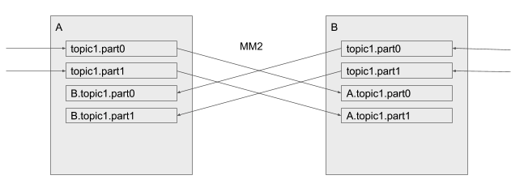

# Kafka Mirror Maker2

## Mirror Maker2

**기본적으로 단방향 미러링**

기본적으로 MM2는 하나의 소스 클러스터(Source)에서 타겟 클러스터(Target)으로 데이터를 미러링한다

```
clusters = A, B

A.bootstrap.servers = A_host1:9092, A_host2:9092, A_host3:9092
B.bootstrap.servers = B_host1:9092, B_host2:9092, B_host3:9092

A->B.enabled = true
A->B.topics = .*
```

**양방향 미러링 설정**

```
clusters = A, B

A.bootstrap.servers = A_host1:9092, A_host2:9092, A_host3:9092
B.bootstrap.servers = B_host1:9092, B_host2:9092, B_host3:9092

# A -> B 미러링 활성화
A->B.enabled = true
A->B.topics = .*

# B -> A 미러링 활성화
B->A.enabled = true
B->A.topics = .*
```

### 미러링 시 고려해야 할 점

- 무한 루프 방지 : 양방향 미러링을 하면, A에서 B로 복제된 데이터가 다시 A로 복제되는 루프 문제가 발생할 수 있다
이를 방지하려면 미러링된 토픽을 제외하는 필터를 설정한다
    
    ```
    A->B.enabled = true
    A->B.topics = ^((?!B\.).*)$  # B에서 온 미러링된 토픽은 복제하지 않음
    
    B->A.enabled = true
    B->A.topics = ^((?!A\.).*)$  # A에서 온 미러링된 토픽은 복제하지 않음
    ```
    
    A→B 로 토픽 `topic` 미러링 시, `A.topic` 라는 토픽명으로 B 클러스터에 생성된다.
    
    토픽명을 변경하지 않는다는 설정이 가능한데, 무한 루프로 데이터가 복제될 수 있다. 또한 오프셋 동기화가 적용이 되지 않는다.
    
    ```bash
    replication.policy.class=org.apache.kafka.connect.mirror.IdentityReplicationPolicy
    ```
    
    > IdentityReplicationPolicy does not rename remote topics. This is useful for migrating from legacy MM1, or for any use-case involving one-way replication. N.B. MirrorMaker is not able to prevent cycles when using this class, so take care that your replication topology is acyclic. If migrating from MirrorMaker v1, this will likely already be the case.
    > 

- 컨슈머 그룹 오프셋 동기화
    
    ```
    sync.group.offsets.enabled = true
    ```
    
**MirrorMaker2에서는 오프셋 어떻게 동기화?**

1. **OffsetSync 기록**

`mm2-offset-syncs.A.internal` 를 dc2에서 기록

- source ↔ target offset 간 매핑을 기록

```json
{
  "topic": "logs",
  "partition": 1,
  "upstream_offset": 105,
  "downstream_offset": 103
}
```

2. **Checkpoint 기록**

`A.checkpoints.internal` 를 dc2에서 기록

- 특정 시점에 consumer group의 offset을 source에서 읽고, 해당 offset이 target에서 어디까지 처리되었는지 매핑해서 기록

```bash
./bin/kafka-console-consumer.sh --bootstrap-server A_host1:9092 \
  --topic mm2-offset-syncs.A.internal \
  --formatter org.apache.kafka.connect.mirror.formatters.OffsetSyncFormatter \
  --from-beginning
 
OffsetSync{topicPartition=new-topic-0, upstreamOffset=30, downstreamOffset=30}

./bin/kafka-console-consumer.sh --bootstrap-server A_host1:9092 \
  --topic A.checkpoints.internal \
  --formatter org.apache.kafka.connect.mirror.formatters.OffsetSyncFormatter \
  --from-beginning
 
 OffsetSync{topicPartition=mm-tester-1663864, upstreamOffset=0, downstreamOffset=562949953421312}
```

- 소스 클러스터의 mm-tester 토픽 1663864 파티션에서 offset 0에 있던 메시지 → 
타겟 클러스터의 같은 토픽/파티션에 offset 562949953421312로 복제됨

`562949953421312` = `0x2000000000000`

→ MM2는 내부적으로 복제된 메시지 offset을 가짜 오프셋으로 활용

이렇게 큰 수를 사용하는 이유는:

- 복제된 메시지와 실제 타겟 클러스터의 native 메시지를 구분
- 일부 MM2 설정에서 logical offset space를 따로 유지하기 위해
- offset 공간이 겹치지 않게 하려는 목적

오프셋 미러링 흐름

1. 타겟 클러스터(B)의 컨슈머 → B.checkpoints.internal에서 오프셋을 가져와 적용
2. MM2의 MirrorCheckpointConnector → A의 오프셋을 B.checkpoints.internal 토픽에 복사

MirrorCheckpointConnector가 실행되지 않거나 내부 토픽이 없으면 오프셋 미러링이 동작하지 않는다

```java
    public OptionalLong translateDownstream(String group, TopicPartition sourceTopicPartition, long upstreamOffset) {
        if (!readToEnd) {
            // If we have not read to the end of the syncs topic at least once, decline to translate any offsets.
            // This prevents emitting stale offsets while initially reading the offset syncs topic.
            log.debug("translateDownstream({},{},{}): Skipped (initial offset syncs read still in progress)",
                    group, sourceTopicPartition, upstreamOffset);
            return OptionalLong.empty();
        }
        Optional<OffsetSync> offsetSync = latestOffsetSync(sourceTopicPartition, upstreamOffset);
        if (offsetSync.isPresent()) {
            if (offsetSync.get().upstreamOffset() > upstreamOffset) {
                // Offset is too far in the past to translate accurately
                log.debug("translateDownstream({},{},{}): Skipped ({} is ahead of upstream consumer group {})",
                        group, sourceTopicPartition, upstreamOffset,
                        offsetSync.get(), upstreamOffset);
                return OptionalLong.of(-1L);
            }
            // If the consumer group is ahead of the offset sync, we can translate the upstream offset only 1
            // downstream offset past the offset sync itself. This is because we know that future records must appear
            // ahead of the offset sync, but we cannot estimate how many offsets from the upstream topic
            // will be written vs dropped. If we overestimate, then we may skip the correct offset and have data loss.
            // This also handles consumer groups at the end of a topic whose offsets point past the last valid record.
            // This may cause re-reading of records depending on the age of the offset sync.
            // s=offset sync pair, ?=record may or may not be replicated, g=consumer group offset, r=re-read record
            // source |-s?????r???g-|
            //          |  ______/
            //          | /
            //          vv
            // target |-sg----r-----|
            long upstreamStep = upstreamOffset == offsetSync.get().upstreamOffset() ? 0 : 1;
            log.debug("translateDownstream({},{},{}): Translated {} (relative to {})",
                    group, sourceTopicPartition, upstreamOffset,
                    offsetSync.get().downstreamOffset() + upstreamStep,
                    offsetSync.get()
            );
            return OptionalLong.of(offsetSync.get().downstreamOffset() + upstreamStep);
        } else {
            log.debug("translateDownstream({},{},{}): Skipped (offset sync not found)",
                    group, sourceTopicPartition, upstreamOffset);
            return OptionalLong.empty();
        }
```

- 소스 클러스터 토픽 파티션에서 최신 오프셋(upstreamoffset)을 찾음
- 타겟 클러스터의 오프셋(downstreamoffset)과 동일하면 → downstreamoffset+1로 설정

## 클러스터 구성

kafka 에서 제공되는 데이터 미러링 기능으로 3가지 방법으로 배포 가능하다

- 기존의 커넥트 클러스터에서 커넥터 생성 `connector.class": "org.apache.kafka.connect.mirror.MirrorSourceConnector"`
- dedicated mirror maker 클러스터 생성 `$ ./bin/connect-mirror-maker.sh mm2.properties`
- standalone 클러스터 생성 `./bin/connecti-standalone.sh worker.properties connector.properties`

### Dedicated mirror maker 클러스터

```bash
dedicated.mode.enable.internal.rest = true
```

MM2 내에서 Connect REST API 활성화

- REST API 비활성화면 MM2 내 리더 - 팔로워 간 통신이 불가하여 새로운 토픽이 추가되어도 미러링되지 않는 문제가 있을 수 있나, 활성화하면 팔로워가 새로운 설정에 대해 REST API를 통해 리더에게 알릴 수 있다
- 리더는 설정을 업데이트하고, 전체 클러스터에 적용 가능하다

기존에 같은 클러스터에 카프카 커넥트가 돌아가고 있으면 포트 충돌이 날수도 있음 `Caused by: java.io.IOException: Failed to bind to 0.0.0.0/0.0.0.0:8083`

```bash
clusters = kafka-B,kafka-A
kafka-B.bootstrap.servers = kafka-B-broker01:9092,kafka-B-broker02:9092,kafka-B-broker03:9092
kafka-A.bootstrap.servers = kafka-B-broker01:9092,kafka-B-broker02:9092,kafka-B-broker03:9092

# 양방향 미러링
kafka-B->kafka-A.enabled = true
kafka-A->kafka-B.enabled = true

# 모든 토픽과 그룹을 동기화하도록 설정(기본값)
topics=.*
groups=.*

# 각 클러스터에 독립적으로 존재해야하는 태스크 관련 정보를 가진 토픽은 복제하지 않도록 설정
topics.blacklist=.*[\\-\\.]internal, .*\\.replica, __consumer_offsets
groups.blacklist=console-consumer-.*, connect-.*, __.*

# Setting replication factor of newly created remote topics
replication.factor=3

############################# Internal Topic Settings  #############################
checkpoints.topic.replication.factor=3
heartbeats.topic.replication.factor=3
offset-syncs.topic.replication.factor=3
offset.storage.replication.factor=3
status.storage.replication.factor=3
config.storage.replication.factor=3

# 기존: replication.policy.class=org.apache.kafka.connect.mirror.DefaultReplicationPolicy

dedicated.mode.enable.internal.rest=true

emit.heartbeats.enabled = true
emit.checkpoints.interval.seconds = 1
emit.heartbeats.interval.seconds = 1

sync.topic.acls.enabled = true
sync.group.offsets.enabled = true
sync.group.offsets.interval.seconds = 1
sync.topic.acls.interval.seconds = 1
sync.topic.configs.enabled=true
sync.topic.configs.interval.seconds = 1

refresh.topics.enabled = true
refresh.groups.enabled = true
refresh.topics.interval.seconds = 1
refresh.groups.interval.seconds = 1

```

### 기존의 커넥트 클러스터에서 커넥터 추가

- Source Connector : 데이터 복제
- Checkpoint Connector : 컨슈머 그룹 오프셋 복제
- Hearbeat Connector :  MirrorMaker 2 인스턴스의 상태 확인

카프카 커넥트에 생성( 소스/타겟 카프카 커넥트 클러스터가 다르면 각각에 생성해야 됨 )

```bash
curl -X POST "http://kafka-B-broker01:8083/connectors"  -H "Content-Type: application/json" -d '{
    "name": "MM2-Checkpoint",
    "config":
    {
        "name": "MM2-Checkpoint",
        "connector.class": "org.apache.kafka.connect.mirror.MirrorCheckpointConnector",
        "clusters": "kafka-A, kafka-B",
        "source.cluster.alias": "kafka-A",
        "source.cluster.bootstrap.servers": "kafka-B-broker01:9092,kafka-B-broker02:9092,kafka-B-broker03:9092",
        "target.cluster.alias": "kafka-B",
        "target.cluster.bootstrap.servers": " kafka-B-broker01:9092,kafka-B-broker02:9092,kafka-B-broker03:9092",
        "source.admin.bootstrap.servers": "kafka-B-broker01:9092,kafka-B-broker02:9092,kafka-B-broker03:9092",
        "source.consumer.bootstrap.servers": "kafka-B-broker01:9092,kafka-B-broker02:9092,kafka-B-broker03:9092",
        "source.producer.bootstrap.servers": "kafka-B-broker01:9092,kafka-B-broker02:9092,kafka-B-broker03:9092",
        "target.admin.bootstrap.servers": "kafka-B-broker01:9092,kafka-B-broker02:9092,kafka-B-broker03:9092",
        "target.consumer.bootstrap.servers": "kafka-B-broker01:9092,kafka-B-broker02:9092,kafka-B-broker03:9092",
        "target.producer.bootstrap.servers": "kafka-B-broker01:9092,kafka-B-broker02:9092,kafka-B-broker03:9092",
        "enabled": "true",
        "tasks.max": "3",
        "topics": ".*",
        "groups": ".*",
        "topics.blacklist": ".*[\\-\\.]internal, .*\\.replica, __consumer_offsets, .*[\\-\\.]heartbeats",
        "groups.blacklist": "console-consumer-.*, connect-.*, __.*",
        "replication.factor" :"3",
        "checkpoints.topic.replication.factor" :"3",
        "heartbeats.topic.replication.factor" :"3",
        "offset-syncs.topic.replication.factor" :"3",
        "offset.storage.replication.factor" :"3",
        "status.storage.replication.factor" :"3",
        "config.storage.replication.factor" :"3",
        "emit.checkpoints.enabled": "true",
        "emit.heartbeats.enabled": "true",
        "emit.checkpoints.interval.seconds": "1",
        "emit.heartbeats.interval.seconds": "1",
        "sync.topic.acls.enabled": "true",
        "sync.group.offsets.enabled": "true  ",
        "sync.group.offsets.interval.seconds": "1",
        "sync.topic.acls.interval.seconds": "1",
        "sync.topic.configs.enabl": "true",
        "sync.topic.configs.interval.seconds": "1",
        "refresh.topics.enabled": "true",
        "refresh.groups.enabled": "true",
        "refresh.topics.interval.seconds": "1",
        "refresh.groups.interval.seconds": "1"
    }
}' 
curl -X POST "http://kafka-B-broker01:8083/connectors"  -H "Content-Type: application/json" -d '{

    "name": "MM2-Heartbeat",
    "config":
    {
        "name":  "MM2-Heartbeat",
        "connector.class": "org.apache.kafka.connect.mirror.MirrorHeartbeatConnector",
        "clusters": "kafka-A, kafka-B",
        "source.cluster.alias": "kafka-A",
        "source.cluster.bootstrap.servers": "kafka-B-broker01:9092,kafka-B-broker02:9092,kafka-B-broker03:9092",
        "target.cluster.alias": "kafka-B",
        "target.cluster.bootstrap.servers": " kafka-B-broker01:9092,kafka-B-broker02:9092,kafka-B-broker03:9092",
        "source.admin.bootstrap.servers": "kafka-B-broker01:9092,kafka-B-broker02:9092,kafka-B-broker03:9092",
        "source.consumer.bootstrap.servers": "kafka-B-broker01:9092,kafka-B-broker02:9092,kafka-B-broker03:9092",
        "source.producer.bootstrap.servers": "kafka-B-broker01:9092,kafka-B-broker02:9092,kafka-B-broker03:9092",
        "target.admin.bootstrap.servers": "kafka-B-broker01:9092,kafka-B-broker02:9092,kafka-B-broker03:9092",
        "target.consumer.bootstrap.servers": "kafka-B-broker01:9092,kafka-B-broker02:9092,kafka-B-broker03:9092",
        "target.producer.bootstrap.servers": "kafka-B-broker01:9092,kafka-B-broker02:9092,kafka-B-broker03:9092",
        "enabled": "true",
        "tasks.max": "3",
        "topics": ".*",
        "groups": ".*",
        "topics.blacklist": ".*[\\-\\.]internal, .*\\.replica, __consumer_offsets, .*[\\-\\.]heartbeats",
        "groups.blacklist": "console-consumer-.*, connect-.*, __.*",
        "replication.factor" :"3",
        "checkpoints.topic.replication.factor" :"3",
        "heartbeats.topic.replication.factor" :"3",
        "offset-syncs.topic.replication.factor" :"3",
        "offset.storage.replication.factor" :"3",
        "status.storage.replication.factor" :"3",
        "config.storage.replication.factor" :"3",
        "emit.checkpoints.enabled": "true",
        "emit.heartbeats.enabled": "true",
        "emit.checkpoints.interval.seconds": "1",
        "emit.heartbeats.interval.seconds": "1",
        "sync.topic.acls.enabled": "true",
        "sync.group.offsets.enabled": "true  ",
        "sync.group.offsets.interval.seconds": "1",
        "sync.topic.acls.interval.seconds": "1",
        "sync.topic.configs.enabl": "true",
        "sync.topic.configs.interval.seconds": "1",
        "refresh.topics.enabled": "true",
        "refresh.groups.enabled": "true",
        "refresh.topics.interval.seconds": "1",
        "refresh.groups.interval.seconds": "1"
    }
}' 

curl -X POST "http://kafka-B-broker01:8083/connectors"  -H "Content-Type: application/json" -d '{
    "name": "MM2-Source",
    "config":
    {
        "name":  "MM2-Source",
        "connector.class": "org.apache.kafka.connect.mirror.MirrorSourceConnector",
        "clusters": "kafka-A, kafka-B",
        "source.cluster.alias": "kafka-A",
        "source.cluster.bootstrap.servers": "kafka-B-broker01:9092,kafka-B-broker02:9092,kafka-B-broker03:9092",
        "source.admin.bootstrap.servers": "kafka-B-broker01:9092,kafka-B-broker02:9092,kafka-B-broker03:9092",
        "source.consumer.bootstrap.servers": "kafka-B-broker01:9092,kafka-B-broker02:9092,kafka-B-broker03:9092",
        "source.producer.bootstrap.servers": "kafka-B-broker01:9092,kafka-B-broker02:9092,kafka-B-broker03:9092",
        "target.cluster.alias": "kafka-B",
        "target.cluster.bootstrap.servers": " kafka-B-broker01:9092,kafka-B-broker02:9092,kafka-B-broker03:9092",		
        "target.admin.bootstrap.servers": "kafka-B-broker01:9092,kafka-B-broker02:9092,kafka-B-broker03:9092",
        "target.consumer.bootstrap.servers": "kafka-B-broker01:9092,kafka-B-broker02:9092,kafka-B-broker03:9092",
        "target.producer.bootstrap.servers": "kafka-B-broker01:9092,kafka-B-broker02:9092,kafka-B-broker03:9092",
        "enabled": "true",
        "tasks.max": "3",
        "topics": ".*",
        "groups": ".*",
        "topics.blacklist": ".*[\\-\\.]internal, .*\\.replica, __consumer_offsets, .*[\\-\\.]heartbeats",
        "groups.blacklist": "console-consumer-.*, connect-.*, __.*",
        "replication.factor" :"3",
        "checkpoints.topic.replication.factor" :"3",
        "heartbeats.topic.replication.factor" :"3",
        "offset-syncs.topic.replication.factor" :"3",
        "offset.storage.replication.factor" :"3",
        "status.storage.replication.factor" :"3",
        "config.storage.replication.factor" :"3",
        "emit.checkpoints.enabled": "true",
        "emit.heartbeats.enabled": "true",
        "emit.checkpoints.interval.seconds": "1",
        "emit.heartbeats.interval.seconds": "1",
        "sync.topic.acls.enabled": "true",
        "sync.group.offsets.enabled": "true  ",
        "sync.group.offsets.interval.seconds": "1",
        "sync.topic.acls.interval.seconds": "1",
        "sync.topic.configs.enabl": "true",
        "sync.topic.configs.interval.seconds": "1",
        "refresh.topics.enabled": "true",
        "refresh.groups.enabled": "true",
        "refresh.topics.interval.seconds": "1",
        "refresh.groups.interval.seconds": "1",
        "consumer.group.id": "mm2-msc",
        "producer.enable.idempotence": "true"
    }
}'
```

## 문제점

토픽명을 동일하게 하면 무한 루프로 복제될 수 있고, 컨슈머 그룹 오프셋 미러링이 안되므로, 타겟 클러스터에는 소스 클러스터를 프리픽스로 토픽명을 생성

- 컨슈머는 2개 이상의 토픽명을 바라보게 해야함

active - active 구성 시



- 양방향 미러링 적용하고 각 클러스터에 토픽 추가, 서로를 미러링하는 토픽은 따로 있음
- 미러링되는 토픽 간에는 컨슈머 그룹 오프셋은 복제되나, 처음 생성된 클러스터의 동일한 토픽명에는 오프셋이 다를수밖에 없음

active - standby 구성 시


- active → standby로 단방향 미러링
- failover이 발생하는 동안 메시지 유실이 발생할 수 있음
- DCI 단절 일어나면 단방향 미러링 불가, 다른 dc의 클라이언트에서는 active 클러스터에 접속하지 못함
- 미러링과 오프셋 복제가 간단하나 failover에 대한 시나리오 필요


---

https://cwiki.apache.org/confluence/display/KAFKA/KIP-382%3A+MirrorMaker+2.0#KIP382:MirrorMaker2.0-Walkthrough:RunningMirrorMaker2.0

https://learn.conduktor.io/kafka/kafka-cluster-setup-overview/

https://docs.redhat.com/ko/documentation/red_hat_streams_for_apache_kafka/2.0/html/using_amq_streams_on_rhel/proc-mirrormaker-replication-str

https://docs.redhat.com/ko/documentation/red_hat_streams_for_apache_kafka/2.3/html/configuring_amq_streams_on_openshift/assembly-mirrormaker-str#proc-mirrormaker-replication-str

https://docs.redhat.com/ko/documentation/red_hat_streams_for_apache_kafka/2.5/html/deploying_and_managing_amq_streams_on_openshift/con-config-mirrormaker2-str#con-config-mirrormaker2-connectors-str

https://developers.redhat.com/articles/2023/11/13/demystifying-kafka-mirrormaker-2-use-cases-and-architecture#architecture_design_scenarios

https://cloud.samsungsds.com/serviceportal/assets/pdf/en/SDS_Technical_Guide_Configuring_Apache_Kafka_DR_using_MirrorMaker_2_v1_eng.pdf

https://cwiki.apache.org/confluence/display/KAFKA/KIP-382%3A+MirrorMaker+2.0

https://devidea.tistory.com/112

https://aiven.io/docs/products/kafka/kafka-mirrormaker/concepts/disaster-recovery/active-passive-setup

https://aiven.io/docs/products/kafka/kafka-mirrormaker/concepts/disaster-recovery/active-active-setup