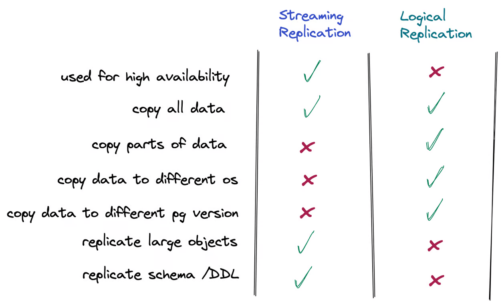

## Logical Replication



Master(Publication)

```sql
-- wal 데이터에 logical replication에 필요한 정보를 저장하기 위한 레벨 설정
echo "wal_level = logical" >> $PGDATA/postgresql.conf

-- 외부에서 접속하기 위한 설정
echo "host    all             all             0.0.0.0/0               md5" >> $PGDATA/pg_hba.conf

-- Replication 유저 생성
CREATE USER repl WITH REPLICATION PASSWORD 'repl1122' ;
GRANT ALL PRIVILEGES ON DATABASE test TO repl;       

-- 테스트 데이터베이스 안의 public 테이블인 tb1에 대한 권한 부여
GRANT ALL PRIVILEGES ON ALL TABLES IN SCHEMA public TO repl;

-- publication 설정
CREATE PUBLICATION pub_tb1 FOR TABLE tb1;
```

Replication(subscription) : DDL은 적용되지 않으므로 테이블을 우선 생성해줘야 함

```sql
-- 테스트 데이터 베이스 생성
CREATE DATABASE test ;

-- 테스트 테이블 생성
CREATE TABLE tb1 ( id int primary key, name varchar(10) ) ;

-- subscription 설정 (master의 publication 이름과 Replication 유저 정보 입력)
CREATE SUBSCRIPTION sub_tb1 CONNECTION 'host=192.168.56.116 user=repl password=repl1122 port=5410 dbname=test' PUBLICATION pub_tb1;
```

### initial snapshot
논리적 복제 적용 프로세스는 현재 명령문 트리거가 아닌 행 트리거만 실행합니다. 그러나 초기 테이블 동기화는 COPY 명령처럼 구현되므로 INSERT 에 대한 행 및 명령문 트리거를 모두 실행합니다.

기존 구독 테이블의 초기 데이터는 특별한 종류의 적용 프로세스의 병렬 인스턴스에서 스냅샷 및 복사됩니다. 이 프로세스는 자체 복제 슬롯을 생성하고 기존 데이터를 복사합니다. 복사가 완료되는 즉시 테이블 내용이 다른 백엔드에 표시됩니다. 기존 데이터가 복사되면 작업자는 동기화 모드로 들어가 표준 논리적 복제를 사용하여 초기 데이터 복사 중에 발생한 모든 변경 사항을 스트리밍하여 테이블을 기본 적용 프로세스와 동기화된 상태로 가져옵니다. 이 동기화 단계에서 변경 사항은 게시자에서 발생한 것과 동일한 순서로 적용 및 커밋됩니다. 동기화가 완료되면 복제가 정상적으로 계속되는 기본 적용 프로세스에 테이블 복제 제어가 다시 제공됩니다.


---

## Reference 
- [Logical Replication](https://bstar36.tistory.com/397)
- [DB 인사이드 | PostgreSQL Replication - 종류 ](https://blog.ex-em.com/1781)
- [PostgreSQL logical replication - 1](https://kimdubi.github.io/postgresql/pg_logical_replication_1/)
- [Data To Go: Postgres Logical Replication](https://www.crunchydata.com/blog/data-to-go-postgres-logical-replication)
- [PostgreSQL 15.0 - Logical Replication - 31.7. Architecture](https://runebook.dev/ko/docs/postgresql/logical-replication-architecture)